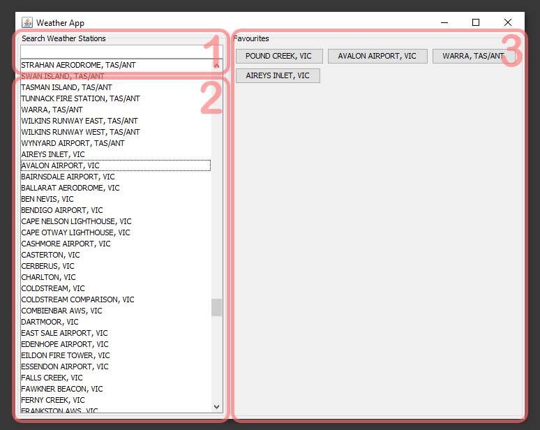
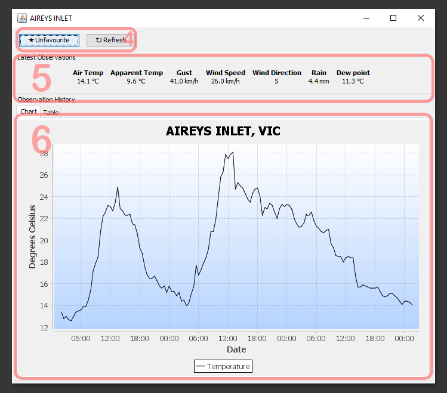
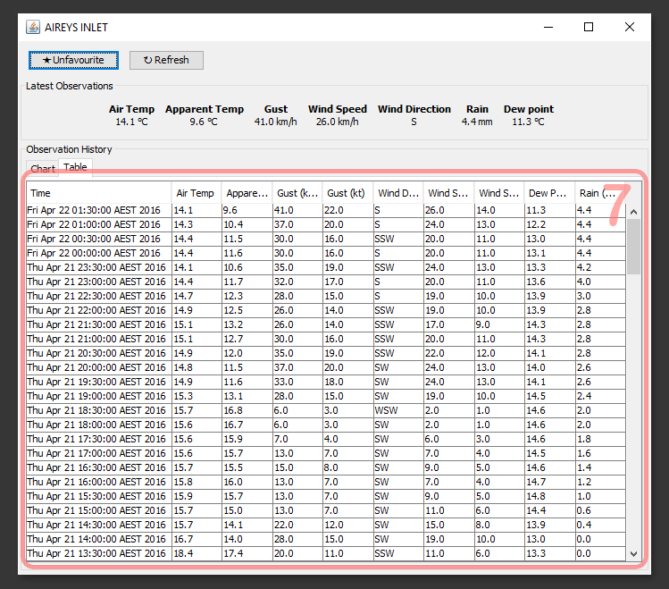

#HOWTO

##Installation
To install and compile this software see **Building** for details.

Release versions of weather app are distributed in a zip file named weather-app-\<version number>.zip.
To use this only as an application, the user only needs to run the supplied "Weather-Application" JAR file.


```bash
$ mkdir ~/weather-app
$ unzip ~/Downloads/weather-app-0.1.zip -d ~/weather-app/
$ cd weather-app
$ java -jar weather-app-0.1.jar
```


##Usage

 This is a basic overview. Please consult the [User Manual](User Manual.pdf) for a detailed explanation of the program.

###The Interface
#####*Main Window:*


1) **Search bar** - A search bar to filter the station list

2) **Station list** -  A list that shows all the known weather stations by default.

3) **Favorites panel** - You favorite stations will appear here for easy access.

#####*Details Window:*



4) **Favorite and refresh buttons** - Buttons to add the current station to favorites, or to refresh the observation data.

5) **Latest observation details** - The latest observations retrieved from BOM site.

6) **Temperature history chart** - A simple plot of the temperature change over time.



7) **Observation history table** -  A table containing detailed observation history for that station.

###Updating stations:
Weather station information is stored in [.weather_stations.json](../.weather_stations.json) as an array of weather station objects.

If you wish to edit the weather stations known by the program, simply edit the [.weather_stations.json](../.weather_stations.json) file. This file should be located in the same directory as the jar file, or the root directory of the project.

####Adding a weather station
Weather stations objects in [.weather_stations.json](../.weather_stations.json) adhere to the following format:
```json
  {
    "stationID": 85072,
    "wmoNumber": 94907,
    "name": "EAST SALE AIRPORT",
    "state": "VIC",
    "code": "V"
  }
```

To add a weather station, insert the appropriate object into file:

```json
[
  {
    "stationID": 58198,
    "wmoNumber": 94596,
    "name": "BALLINA AIRPORT AWS",
    "state": "NSW",
    "code": "N"
  },
  {
    "stationID": 88109,
    "wmoNumber": 94874,
    "name": "MANGALORE AIRPORT",
    "state": "VIC",
    "code": "V"
  },
  {
    "stationID": 85072,
    "wmoNumber": 94907,
    "name": "EAST SALE AIRPORT",
    "state": "VIC",
    "code": "V"
  }
]
```

To remove, simply delete the specific object from the file.

###Troubleshooting

#####ERROR: Weather Stations file could not be loaded!
Weather station file missing or corrupt. The most likley cause for this is a missing [.weather_stations.json](../.weather_stations.json) file.

#####ERROR: Unable to establish connection to BOM
Program is unable to connect to the BOM website. Please check that your internet connection is active, and that the program is not being blocked by a firewall or other software.

#####ERROR: Unable to save to favorites
May happen if the program is in a protected directory, ensure that you have file write permissions.

##Building:
This project requires java 1.8 or later to build.

###Dependencies:
- [GSON](https://github.com/google/gson)
- [JFreeChart](http://www.jfree.org/jfreechart/)
- [JUnit](http://junit.org/) (testing)
- [Hamcrest](http://hamcrest.org/JavaHamcrest/) (testing)

If gradle has not been set up, run
```bash
$ ./grawdlew init
```
This will set up the gradle project.

To resolve dependencies run

```bash
$ ./gradlew dependencies
```

Once the gradle wrapper has been initialized, to build the project simply run
```bash
$ ./gradlew build
```

If the project has already been built, to execute the application run
```bash
$ ./gradlew run
```

###Testing:

Tests can be run with
```bash
$ ./gradlew test
```
